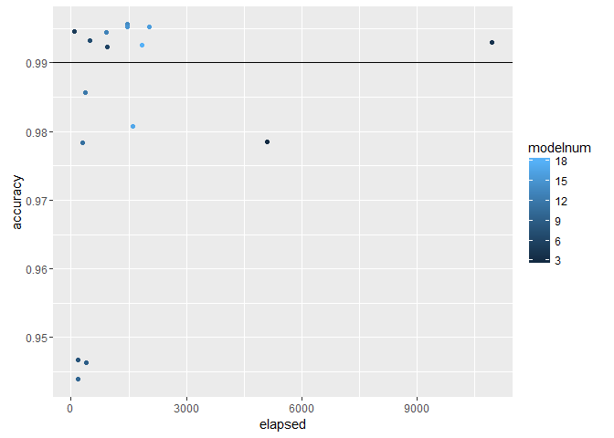
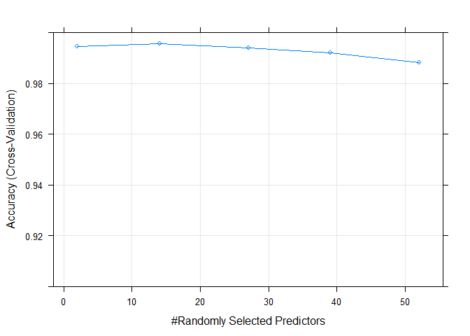

# Practical Machine Learning Course Project Report
Darcy Jamieson  


## Introduction

The following report describes a machine learning algorithm to predict activity quality from activity monitors. It will review the methods and decisions used to tidy the data, select appropriate features, construct and select an appropriate model and evaluate the accuracy of the chosen model.

### Background
Using devices such as Jawbone Up, Nike FuelBand, and Fitbit it is now possible to collect a large amount of data about personal activity relatively inexpensively. These type of devices are part of the quantified self movement – a group of enthusiasts who take measurements about themselves regularly to improve their health, to find patterns in their behavior, or because they are tech geeks. One thing that people regularly do is quantify how much of a particular activity they do, but they rarely quantify how well they do it. In this project, your goal will be to use data from accelerometers on the belt, forearm, arm, and dumbell of 6 participants. They were asked to perform barbell lifts correctly and incorrectly in 5 different ways. More information is available from the website here: http://groupware.les.inf.puc-rio.br/har (see the section on the Weight Lifting Exercise Dataset).

## Feature selection
To determine the appropriate features to use in the model, a tidy dataset was needed for analysis. Since it was not possible to determine which features were appropriate and no codebook was provided, all of the data was input as is and assessed.

### Load and assess datasets


```r
# load data:
training<-read.csv("./pml-training.csv",header=TRUE)
testing<-read.csv("./pml-testing.csv",header=TRUE)

# display a brief summary of the loaded data
str(training,give.attr=F,list.len=length(names(training)))
```

### Tidy dataset
The data appeared to have many blank and special characters with some of the columns set as factors, so these were cleaned and coerced into numeric formats for all measurements (causes the blank and #Div/0 values to become NA). In addition, since the datasets seemed to be disorganised relative to the timestamps and I wasn't sure whether or not to use a time organised  method, a combined timestamp was created and the dataset sorted so that the signals could be plotted in a time-organised manner if desired.


```r
# convert variables to appropriate formats
training$cvtd_timestamp<-as.character(training$cvtd_timestamp)

for(i in 8:159){
  training[,i]<-as.numeric(as.character(training[,i]))
}

# rename incorrect spelling of pitch (picth=pitch)
names(training)<-gsub("picth","pitch",names(training))

# Combine time parts and sort by timestamps
training<-mutate(training,timestamp=raw_timestamp_part_1*1000000+raw_timestamp_part_2,
                 datetimes=as.POSIXct(timestamp/1000000,origin= "1970-01-01")) %>%
  arrange(timestamp)

# Create a time organised index variable
training$index<-as.integer(rownames(training))
```

### Select features
It can be noted that the many of the variables contained summary data at regular intervals based on the *new_window* variable.  Since it was not clear what these variables were or how they were calculated, I decided to simply use the complete measurement variables (Accel, Gyro, Magnet, Total, Roll, Pitch, Yaw from each of the locations: Belt, Arm, Forearm, Dumbbell). A separate dataset was used for the response (classe).


```r
grepnames<-"^(accel|gyros|magnet|pitch|roll|yaw|total)"
x<- select(training,grep(grepnames,names(training)))
y<- as.character(training$classe)
```

## Model selection
Given that the response (classe) is categorical, random forest was chosen and bootstrapping (boot) / K fold (cv) cross-validation methods were assessed.  The initial run using the bootstrapping method took very long to run, therefore it was tested with using different sets of k-folds (cv), repititions, tuning parameters and parallel processing methods were imployed where possible. The different sets of parameters and the results of those tests are provided showing the accuracy versus elapsed time plot. Keeping in mind that the desired accuracy was to be greater 0.99, the *random forest model#14* was selected.


```r
n_rep<-3  # number of repetitions
n_res<-5  # number of folds
n_tunes<-5  # number of tuning parameters

# setup seeds for parallel processing
set.seed(123)
seeds <- vector(mode = "list", length = (n_rep*n_res+1))
for(i in 1:(n_rep*n_res)) seeds[[i]]<- sample.int(n=1000, n_tunes)
seeds[[(n_rep*n_res+1)]]<-sample.int(1000, 1)  #for the last model

# control list
fitControl <- trainControl(method = "cv", number=n_res, repeats=n_rep,seeds=seeds, allowParallel = TRUE)

# set up parallel processing
cluster <- makeCluster(detectCores() - 1) # convention to leave 1 core for OS
registerDoParallel(cluster)

# run model
fit<-train(x,y,method="rf",trControl=fitControl,tuneLength = n_tunes)

#stop parallel processing
stopCluster(cluster)
```

## Model evaluation
The resulting models were evaluated using the accuracy and out-of-bag error rate predicted from the model which used the bootstrapping or k-fold cross validation methods.


```r
# update results table
results<-read.csv("model_results_comparison.csv",header=T)

results <- results %>% 
  rbind(data.frame(
    modelnum=mnum,
    elapsed=round(fit$times$everything[3],2),
    accuracy=round(fit$results$Accuracy[fit$results$mtry==fit$bestTune$mtry],4),
    folds=fit$control$number,
    repeats=fit$control$repeats,
    tuningparams=n_tunes,
    parallel=ifelse(fit$control$allowParallel=="TRUE","yes","no"),
    grepvariables=grepnames,
    method=paste0(fit$method,"/",fit$control$method)
	)) %>%
  arrange(modelnum)

write.csv(results,paste0("model_results_comparison.csv"),row.names=F)
```


```r
# plot results
ggplot(data=results,aes(x=elapsed,y=accuracy,colour=modelnum,label=modelnum))+geom_point()+geom_hline(yintercept = 0.99)
```



### Cross validation
The resulting model used a k-fold (k=5) cross validation process to minimize the bias and variance error is associated with the model.  

```r
fit$control$method
```

```
## [1] "cv"
```

### The predicted Out-of-error from the model

```r
fit$finalModel
```

```
## 
## Call:
##  randomForest(x = x, y = y, mtry = param$mtry) 
##                Type of random forest: classification
##                      Number of trees: 500
## No. of variables tried at each split: 14
## 
##         OOB estimate of  error rate: 0.27%
## Confusion matrix:
##      A    B    C    D    E  class.error
## A 5578    1    0    0    1 0.0003584229
## B   10 3783    4    0    0 0.0036871214
## C    0    9 3409    4    0 0.0037989480
## D    0    0   17 3197    2 0.0059079602
## E    0    0    1    4 3602 0.0013861935
```

### Accuracy
The estimated model accuracy is determined from the cross-validation of the model using the best mtry: 0.9955663

```r
plot(fit, ylim = c(0.9, 1))
```



## Predictions
The test dataset was loaded, tidyed and prepared in the same method as the training set prior to running the predictions. It is expected that there is a 91.5 % chance of returning all of the correct classes for the testing set. 


```r
# prediction
xtest<- select(testing,grep(grepnames,names(testing)))

predictions <- data.frame(problem_id=testing$problem_id,prediction=as.character(predict(fit, xtest)))
```

## Notes

Thank you to the authors of the published source of the data and paper on qualitative activity recognition:

1. Velloso, E.; Bulling, A.; Gellersen, H.; Ugulino, W.; Fuks, H. [Qualitative Activity Recognition of Weight Lifting Exercises](http://groupware.les.inf.puc-rio.br/har#ixzz34irPKNuZ). *Proceedings of 4th International Conference in Cooperation with SIGCHI (Augmented Human '13)*. Stuttgart, Germany: ACM SIGCHI, 2013.

